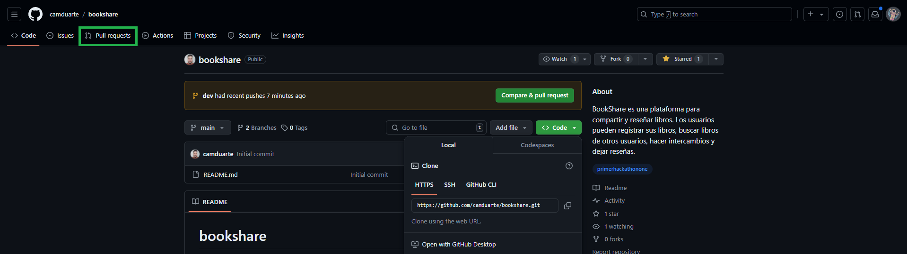
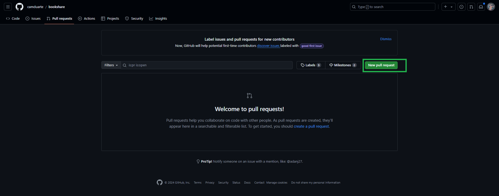
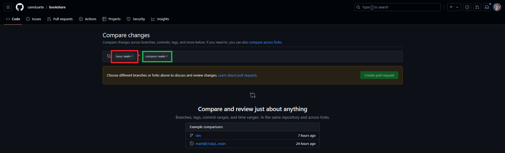
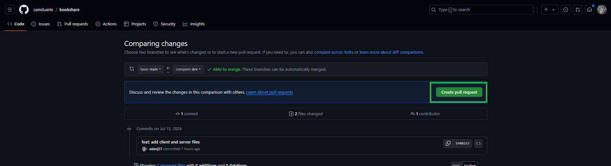
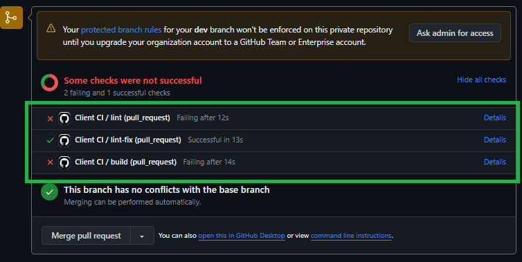

<div align="center">

<h1>BookShare</h1>
</div>

## Introducción

- Pasos para tener una contribución efectiva.

### Requisitos
- Node.js (>= 18.x) - Comando en la terminal para ver la versión `node -v` o `node --version`
- npm (>= 8.x) - Comando en la terminal para ver la versión `npm -v` o `npm --version`

### Instalación
1. **Clona el repositorio:**
```bash
git clone https://github.com/camduarte/bookshare.git
```

2. **Comandos de git:**
- Comando para ver todas las ramas en Git
```bash
git branch -a
```
respuesta esperada:
```bash
main
remotes/origin/HEAD -> origin/main
remotes/origin/dev-frontend
remotes/origin/dev
remotes/origin/main
```

- Rama para trabajar con el equipo `Frontend` - `dev-frontend`
- Comando de git para cambiar de rama
```bash
git switch dev-frontend
```

#### Crear tu propia rama
- Nombre de rama a usar `feat:NombreDel Desarrollador-dev`
- Este comando crea una nueva rama y cambia a ella directamente.
```bash
- Ejemplos
git switch -c feat:Adan-Jimenez-dev
```

3. **Instalación de dependencias:**
- Siempre asegurarse de estar ubicado en la carpeta del proyecto `React` - `bookshare/client`
```bash
- Comando para cambiar de carpeta
cd client
```

- Instalación de dependencias `node_modules`
```bash
npm install
```

4. **Iniciar el Proyecto:**
```bash
npm run dev
```

#### Sugerencias antes de iniciar una nueva tarea
- Obtener los nuevos cambios hechos por otros compañeros
```bash
git pull origin dev-frontend
```
- Este comando trae los nuevos cambios del repositorio a tu rama local

## Estructura del Proyecto
- Ejemplo
```
client/
├── public/
│   ├── vite.svg
│   └── ...
├── src/
│   ├── assets/
|   |   |── logo
│   │   ├── images/
│   ├── components/
│   │   ├── Button.jsx
│   │   └── ...
│   ├── router/
│   │   ├── AppRouter.jsx
│   │   └── ...
│   ├── lib/
│   │   ├── utils/
│   │   │   ├── formatDate.js
│   │   │   └── validation.js
│   │   ├── services/
│   │   │   ├── api.js
│   │   │   └── localStorage.js
│   │   ├── hooks/
│   │   │   └── useDebounce.js
│   │   ├── constants/
│   │   │   └── appConstants.js
│   │   └── config/
│   │       └── appConfig.js
│   ├── pages/
│   │   ├── Home.jsx
│   │   └── ...
│   ├── styles/
│   │   ├── base/
│   │       │   ├── reset.css
│   │       │   ├── variables.css
│   │       │   └── ...
│   │       ├── components/
│   │       │   ├── Button.css
│   │       │   └── ...
│   │       ├── pages/
│   │       │   ├── Home.css
│   │       │   └── ...
│   │       └── index.css
│   ├── main.jsx
│   └── ...
├── .gitignore
├── package.json
└── README.md

```

## Continuar con la tarea asignada

### Pasos siguientes
Revisar el código y verificar que no presente errores con el siguiente comando:
```bash
npm run lint
```
- Ejemplo de errores


- Formatear el código y resolver algunos errores:
```bash
npm run lint:fix
```

Si sigue presentando algun error parecido resolverlo, o pedir ayuda a un compañero para resolverlo.

- Si no presenta errores continuar con el commmit del código hecho

#### Commit de los cambios realizados
- 1. Primero hacer commit en local:
```bash
git add .
git commit -m "Tu mensaje commit aqui"
```

- 2. Push de la rama local al repositorio remoto:
```bash
git push origin -u nombre-de-tu-rama
```

### Abrir una pull request en github
- Entrar al repositorio en github: https://github.com/camduarte/bookshare
- Paso 1 - Click en Pull Request


- Paso 2 - Click en New Pull Request


- Paso 3 - Elegir las ramas que quieras comparar
Asegurarse que base sea dev-frontend y compare sea tu rama subida `base: dev-frontend` y `compare:tu-rama` 


- Paso 4  - Click en Create pull request 


- Paso 5  - Ejecución de pruebas en segundo plano
- Una vez creada la pull request se ejecutaran pruebas de eslint y build
- Si el check es verde significa que pasaron las pruebas
Si el check es rojo significa que hay una falla en las pruebas (revisar el código o pedir ayuda para resolver el problema)


